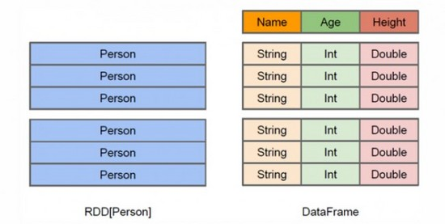
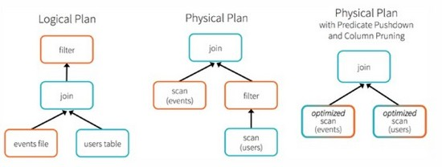

#Spark SQL, DataFrames and Datasets Guide

注明：翻译过程中参考了[《Spark 官方文档》Spark SQL, DataFrames 以及 Datasets 编程指南](http://ifeve.com/spark-sql-dataframes/)。

官方文档链接是：[Spark SQL, DataFrames and Datasets Guide](http://spark.apache.org/docs/latest/sql-programming-guide.html)

在翻译之前先说下个人理解的RDD、DataFrame和Datasets的关系，这有助于理解本文。
[APACHE SPARK: RDD, DATAFRAME OR DATASET?](http://www.agildata.com/apache-spark-rdd-vs-dataframe-vs-dataset/)

这三者其实都可以理解为关系型数据库中的表，或者称之为关系(relation)。

总体来说，DataFrame多了数据的结构信息，即schema。

RDD是分布式的Java对象集合，也称之为弹性分布式数据集。

DataFrame是分布式的Row对象的集合。

##RDD和DataFrame

如上图所示左侧的RDD[Person]虽然以Person为类型参数，但Spark框架本身不了解 Person类的内部结构。而右侧的DataFrame却提供了详细的结构信息，使得Spark SQL可以清楚地知道该数据集中包含哪些列，每列的名称和类型各是什么。DataFrame多了数据的结构信息，即schema。RDD是分布式的 Java对象的集合。DataFrame是分布式的Row对象的集合。DataFrame除了提供了比RDD更丰富的算子以外，更重要的特点是提升执行效率、减少数据读取以及执行计划的优化，比如filter下推、裁剪等。

###提升执行效率

RDD API是函数式的，强调不变性，在大部分场景下倾向于创建新对象而不是修改老对象。这一特点虽然带来了干净整洁的API，却也使得Spark应用程序在运行期倾向于创建大量临时对象，对GC造成压力。在现有RDD API的基础之上，我们固然可以利用mapPartitions方法来重载RDD单个分片内的数据创建方式，用复用可变对象的方式来减小对象分配和GC的开销，但这牺牲了代码的可读性，而且要求开发者对Spark运行时机制有一定的了解，门槛较高。另一方面，Spark SQL在框架内部已经在各种可能的情况下尽量重用对象，这样做虽然在内部会打破了不变性，但在将数据返回给用户时，还会重新转为不可变数据。利用 DataFrame API进行开发，可以免费地享受到这些优化效果。

###减少数据读取

分析大数据，最快的方法就是 ——忽略它。这里的“忽略”并不是熟视无睹，而是根据查询条件进行恰当的剪枝。

上文讨论分区表时提到的分区剪 枝便是其中一种——当查询的过滤条件中涉及到分区列时，我们可以根据查询条件剪掉肯定不包含目标数据的分区目录，从而减少IO。

对于一些“智能”数据格 式，Spark SQL还可以根据数据文件中附带的统计信息来进行剪枝。简单来说，在这类数据格式中，数据是分段保存的，每段数据都带有最大值、最小值、null值数量等 一些基本的统计信息。当统计信息表名某一数据段肯定不包括符合查询条件的目标数据时，该数据段就可以直接跳过(例如某整数列a某段的最大值为100，而查询条件要求a > 200)。

此外，Spark SQL也可以充分利用RCFile、ORC、Parquet等列式存储格式的优势，仅扫描查询真正涉及的列，忽略其余列的数据。

###执行优化

为了说明查询优化，我们来看上图展示的人口数据分析的示例。图中构造了两个DataFrame，将它们join之后又做了一次filter操作。如果原封不动地执行这个执行计划，最终的执行效率是不高的。因为join是一个代价较大的操作，也可能会产生一个较大的数据集。如果我们能将filter 下推到 join下方，先对DataFrame进行过滤，再join过滤后的较小的结果集，便可以有效缩短执行时间。而Spark SQL的查询优化器正是这样做的。简而言之，逻辑查询计划优化就是一个利用基于关系代数的等价变换，将高成本的操作替换为低成本操作的过程。

得到的优化执行计划在转换成物 理执行计划的过程中，还可以根据具体的数据源的特性将过滤条件下推至数据源内。最右侧的物理执行计划中Filter之所以消失不见，就是因为溶入了用于执行最终的读取操作的表扫描节点内。

对于普通开发者而言，查询优化 器的意义在于，即便是经验并不丰富的程序员写出的次优的查询，也可以被尽量转换为高效的形式予以执行。

##RDD和Datasets

* DataSet以Catalyst逻辑执行计划表示，并且数据以编码的二进制形式被存储，不需要反序列化就可以执行sorting、shuffle等操作。
* DataSet创立需要一个显式的Encoder，把对象序列化为二进制，可以把对象的scheme映射为SparkSQl类型，然而RDD依赖于运行时反射机制。

##DataFrame和Datasets

Dataset可以认为是DataFrame的一个特例，主要区别是Dataset每一个record存储的是一个强类型值而不是一个Row。因此具有如下三个特点：

DataSet可以在编译时检查类型

并且是面向对象的编程接口。用wordcount举例：

    //DataFrame
    
    // Load a text file and interpret each line as a java.lang.String
    val ds = sqlContext.read.text("/home/spark/1.6/lines").as[String]
    val result = ds
      .flatMap(_.split(" "))   // Split on whitespace
      .filter(_ != "") // Filter empty words
      .toDF()  // Convert to DataFrame to perform aggregation / sorting
      .groupBy($"value")   // Count number of occurences of each word
      .agg(count("*") as "numOccurances")
      .orderBy($"numOccurances" desc)  // Show most common words first

后面版本DataFrame会继承DataSet，DataFrame是面向Spark SQL的接口。

	//DataSet,完全使用scala编程，不要切换到DataFrame

	val wordCount = 
  	ds.flatMap(_.split(" "))
    .filter(_ != "")
    .groupBy(_.toLowerCase()) // Instead of grouping on a column expression (i.e. $"value") we pass a lambda function
    .count()

DataFrame和DataSet可以相互转化， df.as[ElementType] 这样可以把DataFrame转化为DataSet， ds.toDF() 这样可以把DataSet转化为DataFrame

------------------------------------------------------
**以下是文档翻译**

##Overview

Spark SQL是spark中处理结构化数据的模块，不像底层的Spark RDD API，Spark SQL的接口提供了更多的关于数据和正在执行的任务的结构信息。在Spark内部，Spark SQL利用这些额外的信息来执行更多的优化。

现在有三种方式可以和Spark SQL交互:SQL语句、DataFrame API和Datasets API。当Spark计算结果时，用的执行引擎是一样的，独立于你使用了怎么样的api或者语言来描述计算过程。

这样的底层统一的方式意味着开发者在这些API中很方便的切换，并且这些API提供了最自然的方式来执行RDD的转换操作。

本文中的所有例子都使用Spakr发布版本的样例数据，并且可以在**spark-shell**，**pyspark shell**,或者**sparkR shell**中运行。

##SQL

Spark SQL的一种用法就是执行SQL查询，用最基本的SQL语法或者HiveQL。
Spark SQL也可以从已安装的Hive系统中读取数据。关于更详细的如何配置这个特性的说明请参考：[Hive Tablees](http://spark.apache.org/docs/latest/sql-programming-guide.html#hive-tables)这一节。如果用其它编程语言运行SQL，那么会以DataFrame的方式返回结果。你也可以使用[command line](http://spark.apache.org/docs/latest/sql-programming-guide.html#running-the-spark-sql-cli)和[JDBC/ODBC](http://spark.apache.org/docs/latest/sql-programming-guide.html#running-the-thrift-jdbcodbc-server)的方式使用Spark SQL接口。

## DataFrames

DataFrame就是用命名的列来组织的分布式数据集合，概念上等同于关系型数据库中的表，或者是R和python中的data frame，只不过DataFrame在底层做了更多的优化。DataFrame可以从不同的数据源([sources](http://spark.apache.org/docs/latest/sql-programming-guide.html#data-sources))构造数据,比如结构化的数据文件，Hive中的表，外部数据库，或者已有的RDD。

##Datasets

Dataset是Spark1.6中新加的实验性质的接口，就是为了利用RDD的各种便利(强类型，强大的使用lambda表达式的能力)和Spark SQL优化后的执行引擎的便利。Dataset可以从JVM对象构建，而后就可以使用各种函数式变换(transformations)，比如：map、flatMap、filter等等。

统一的Dataset API支持scala和java，但是还不支持python，但是python自身语言的动态特性，Datasets的许多便利处也能享受到，比如，你可以通过row.columnName来访问行的字段。对python的完整支持会在未来加进来。

##Getting Started

Spark SQL所有功能的入口点是都是[SQLContext](http://spark.apache.org/docs/latest/api/scala/index.html#org.apache.spark.sql.SQLContext)类，或者它的子类。通过SparkContext就可以创建一个基本的SQLContext。

	val sc: SparkContext // An existing SparkContext.
	val sqlContext = new org.apache.spark.sql.SQLContext(sc)

	// this is used to implicitly convert an RDD to a DataFrame.
	import sqlContext.implicits._

除了创建SQLContext外，你也可以创建HiveContext，HiveContext是SQLContext的超集，除了SQLContext的功能外，HiveContext还提供了完整HiveQL解析语法，访问Hive UDFs还有从Hive tables读取数据的能力。为了使用HiveContex，你并不需要安装Hive，而且SparkSQL能用的数据源，HiveContext也能用。HiveContext是单独打包的就是为了避免在默认的Spark版本中包含所有的Hive的依赖。如果这些依赖对你来说都不是问题(不会造成依赖冲突)，那么建议你使用Spark1.3版本或者更早，因为后续的版本关注把SQLContext升级到和HiveContext同等地位。

spark.sql.dialect选项用来选择具体的解析查询语句的SQL变种，这个参数可以用SQLContext中的setConf方法来改变，也可以通过SQL语句的SET key=value命令来指定。该配置目前唯一的可选值就是”sql”，这个变种使用一个Spark SQL自带的简易SQL解析器。而对于HiveContext，spark.sql.dialect 默认值为”hiveql”，当然你也可以将其值设回”sql”。仅就目前而言，HiveSQL解析器支持更加完整的SQL语法，所以大部分情况下，推荐使用HiveContext。

##Creating DataFrames

Spark应用可以用SQLContext从[existing RDD](http://spark.apache.org/docs/latest/sql-programming-guide.html#interoperating-with-rdds)、Hive表或者[data sources](http://spark.apache.org/docs/latest/sql-programming-guide.html#data-sources)。

下面的例子就是从一个json文件来创建DataFrame。

	val sc: SparkContext // An existing SparkContext.
	val sqlContext = new org.apache.spark.sql.SQLContext(sc)

	val df = sqlContext.read.json("examples/src/main/resources/people.json")

	// Displays the content of the DataFrame to stdout
	df.show()

## DataFrame Operations

DataFrame提供了操作结构化数据的领域特定语言，比如scala、java、python、R。

这里我们给出用DataFrame处理结构化数据的基础例子。

    val sc: SparkContext // An existing SparkContext.
    val sqlContext = new org.apache.spark.sql.SQLContext(sc)
    
    // Create the DataFrame
    val df = sqlContext.read.json("examples/src/main/resources/people.json")
    
    // Show the content of the DataFrame
    df.show()
    // age  name
    // null Michael
    // 30   Andy
    // 19   Justin
    
    // Print the schema in a tree format
    df.printSchema()
    // root
    // |-- age: long (nullable = true)
    // |-- name: string (nullable = true)
    
    // Select only the "name" column
    df.select("name").show()
    // name
    // Michael
    // Andy
    // Justin
    
    // Select everybody, but increment the age by 1
    df.select(df("name"), df("age") + 1).show()
    // name(age + 1)
    // Michael null
    // Andy31
    // Justin  20
    
    // Select people older than 21
    df.filter(df("age") 21).show()
    // age name
    // 30  Andy
    
    // Count people by age
    df.groupBy("age").count().show()
    // age  count
    // null 1
    // 19   1
    // 30   1

DataFrame的完整操作列表请参考：[API Documentation](http://spark.apache.org/docs/latest/api/scala/index.html#org.apache.spark.sql.DataFrame)。

除了简单的字段引用和表达式支持外，DataFrame还提供了丰富的工具库，比如：字符串操作，日期处理，常用的数学表达式等。完整列表见：[DataFrame Function Reference](http://spark.apache.org/docs/latest/api/scala/index.html#org.apache.spark.sql.functions$)。

##Running SQL Queries Programmatically

SQLContext.sql能够使Spark应用用编程的方式运行SQL查询并且以DataFrame的形式返回结果。

	val sqlContext = ... // An existing SQLContext
	val df = sqlContext.sql("SELECT * FROM table")

##Creating Datasets

Datasets和RDD类似，不过它不用java序列化或者Kryo，而是用专门的编码器([Encoder](http://spark.apache.org/docs/latest/api/scala/index.html#org.apache.spark.sql.Encoder))来序列化跨网络的处理的传输。如果这个编码器和标准序列化都能把对象转字节，那么编码器就可以根据代码动态生成，并使用一种特殊数据格式，这种格式下的对象不需要反序列化回来，就能允许Spark进行操作，如过滤、排序、哈希等。

    // Encoders for most common types are automatically provided by importing sqlContext.implicits._
    val ds = Seq(1, 2, 3).toDS()
    ds.map(_ + 1).collect() // Returns: Array(2, 3, 4)
    
    // Encoders are also created for case classes.
    case class Person(name: String, age: Long)
    val ds = Seq(Person("Andy", 32)).toDS()
    
    // DataFrames can be converted to a Dataset by providing a class. Mapping will be done by name.
    val path = "examples/src/main/resources/people.json"
    val people = sqlContext.read.json(path).as[Person]

##Interoperating with RDDs

Spark SQL提供了两种方法将RDD转为DataFrame。

第一种方式：使用反射机制，推导包含指定类型对象RDD的schema。这种基于反射机制的方法使代码更简洁，而且如果你事先知道数据schema，推荐使用这种方式；

第二种方式：编程方式构建一个schema，然后应用到指定RDD上。这种方式更啰嗦，但如果你事先不知道数据有哪些字段，或者数据schema是运行时读取进来的，那么你很可能需要用这种方式。

##Inferring the Schema Using Reflection

Spark SQL的Scala接口支持自动将包含case class对象的RDD转为DataFrame。对应的case class定义了表的schema。case class的参数名通过反射，映射为表的字段名。case class还可以嵌套一些复杂类型，如Seq和Array。RDD隐式转换成DataFrame后，可以进一步注册成表。随后，你就可以对表中数据使用SQL语句查询了。

    // sc is an existing SparkContext.
    val sqlContext = new org.apache.spark.sql.SQLContext(sc)
    // this is used to implicitly convert an RDD to a DataFrame.
    import sqlContext.implicits._
    
    // Define the schema using a case class.
    // Note: Case classes in Scala 2.10 can support only up to 22 fields. To work around this limit,
    // you can use custom classes that implement the Product interface.
    case class Person(name: String, age: Int)
    
    // Create an RDD of Person objects and register it as a table.
    val people = sc.textFile("examples/src/main/resources/people.txt").map(_.split(",")).map(p => Person(p(0), p(1).trim.toInt)).toDF()
    people.registerTempTable("people")
    
    // SQL statements can be run by using the sql methods provided by sqlContext.
    val teenagers = sqlContext.sql("SELECT name, age FROM people WHERE age >= 13 AND age <= 19")
    
    // The results of SQL queries are DataFrames and support all the normal RDD operations.
    // The columns of a row in the result can be accessed by field index:
    teenagers.map(t => "Name: " + t(0)).collect().foreach(println)
    
    // or by field name:
    teenagers.map(t => "Name: " + t.getAs[String]("name")).collect().foreach(println)
    
    // row.getValuesMap[T] retrieves multiple columns at once into a Map[String, T]
    teenagers.map(_.getValuesMap[Any](List("name", "age"))).collect().foreach(println)
    // Map("name" -> "Justin", "age" -> 19)

##Programmatically Specifying the Schema

如果不能事先通过case class定义schema（例如，记录的字段结构是保存在一个字符串，或者其他文本数据集中，需要先解析，又或者字段对不同用户有所不同），那么你可能需要按以下三个步骤，以编程方式的创建一个DataFrame：

1. 从已有的RDD创建一个包含Row对象的RDD
2. 用StructType创建一个schema，和步骤1中创建的RDD的结构相匹配
3. 把得到的schema应用于包含Row对象的RDD，调用这个方法来实现这一步：SQLContext.createDataFrame

例如：

    // sc is an existing SparkContext.
    val sqlContext = new org.apache.spark.sql.SQLContext(sc)
    
    // Create an RDD
    val people = sc.textFile("examples/src/main/resources/people.txt")
    
    // The schema is encoded in a string
    val schemaString = "name age"
    
    // Import Row.
    import org.apache.spark.sql.Row;
    
    // Import Spark SQL data types
    import org.apache.spark.sql.types.{StructType,StructField,StringType};
    
    // Generate the schema based on the string of schema
    val schema =
      StructType(
    schemaString.split(" ").map(fieldName => StructField(fieldName, StringType, true)))
    
    // Convert records of the RDD (people) to Rows.
    val rowRDD = people.map(_.split(",")).map(p => Row(p(0), p(1).trim))
    
    // Apply the schema to the RDD.
    val peopleDataFrame = sqlContext.createDataFrame(rowRDD, schema)
    
    // Register the DataFrames as a table.
    peopleDataFrame.registerTempTable("people")
    
    // SQL statements can be run by using the sql methods provided by sqlContext.
    val results = sqlContext.sql("SELECT name FROM people")
    
    // The results of SQL queries are DataFrames and support all the normal RDD operations.
    // The columns of a row in the result can be accessed by field index or by field name.
    results.map(t => "Name: " + t(0)).collect().foreach(println)

##Data Sources

Spark SQL支持基于DataFrame操作一系列不同的数据源。DataFrame既可以当成一个普通RDD来操作，也可以将其注册成一个临时表来查询。把DataFrame注册为table之后，你就可以基于这个table执行SQL语句了。本节将描述加载和保存数据的一些通用方法，包含了不同的Spark数据源，然后深入介绍一下内建数据源可用选项。

##Generic Load/Save Functions

在最简单的情况下，所有操作都会以默认类型数据源来加载数据（默认是Parquet，除非修改了spark.sql.sources.default 配置）。

    val df = sqlContext.read.load("examples/src/main/resources/users.parquet")
    df.select("name", "favorite_color").write.save("namesAndFavColors.parquet")

##Manually Specifying Options

你也可以手动指定数据源，并设置一些额外的选项参数。数据源可由其全名指定（如，org.apache.spark.sql.parquet），而对于内建支持的数据源，可以使用简写名（json, parquet, jdbc）。任意类型数据源创建的DataFrame都可以用下面这种语法转成其他类型数据格式。

    val df = sqlContext.read.format("json").load("examples/src/main/resources/people.json")
    df.select("name", "age").write.format("parquet").save("namesAndAges.parquet")

##Run SQL on files directly

Spark SQL还支持直接对文件使用SQL查询，不需要用read方法把文件加载进来。

    val df = sqlContext.sql("SELECT * FROM parquet.`examples/src/main/resources/users.parquet`")

##Save Modes

Save操作有一个可选参数SaveMode，用这个参数可以指定如何处理数据已经存在的情况。很重要的一点是，这些保存模式都没有加锁，所以其操作也不是原子性的。另外，如果使用Overwrite模式，实际操作是，先删除数据，再写新数据。

|Scala/Java |Any Language   | Meaning   |
|	---		|	---			|	---		|
|SaveMode.ErrorIfExists (default)|"error" (default)|（默认模式）从DataFrame向数据源保存数据时，如果数据已经存在，则抛异常。|
|SaveMode.Append|"append"|如果数据或表已经存在，则将DataFrame的数据追加到已有数据的尾部。|
|SaveMode.Overwrite|"overwrite"|如果数据或表已经存在，则用DataFrame数据覆盖之。|
|SaveMode.Ignore|"ignore"|如果数据已经存在，那就放弃保存DataFrame数据。这和SQL里CREATE TABLE IF NOT EXISTS有点类似。|

##Saving to Persistent Tables

在使用HiveContext的时候，DataFrame可以用saveAsTable方法，将数据保存成持久化的表。与registerTempTable不同，saveAsTable会将DataFrame的实际数据内容保存下来，并且在HiveMetastore中创建一个游标指针。持久化的表会一直保留，即使Spark程序重启也没有影响，只要你连接到同一个metastore就可以读取其数据。读取持久化表时，只需要用用表名作为参数，调用SQLContext.table方法即可得到对应DataFrame。

默认情况下，saveAsTable会创建一个”managed table“，也就是说这个表数据的位置是由metastore控制的。同样，如果删除表，其数据也会同步删除。

##Parquet Files

Parquet 是一种流行的列式存储格式。Spark SQL提供对Parquet文件的读写支持，而且Parquet文件能够自动保存原始数据的schema。写Parquet文件的时候，所有的字段都会自动转成nullable，以便向后兼容。

##Loading Data Programmatically

仍然使用上面例子中的数据：

    // sqlContext from the previous example is used in this example.
    // This is used to implicitly convert an RDD to a DataFrame.
    import sqlContext.implicits._
    
    val people: RDD[Person] = ... // An RDD of case class objects, from the previous example.
    
    // The RDD is implicitly converted to a DataFrame by implicits, allowing it to be stored using Parquet.
    people.write.parquet("people.parquet")
    
    // Read in the parquet file created above. Parquet files are self-describing so the schema is preserved.
    // The result of loading a Parquet file is also a DataFrame.
    val parquetFile = sqlContext.read.parquet("people.parquet")
    
    //Parquet files can also be registered as tables and then used in SQL statements.
    parquetFile.registerTempTable("parquetFile")
    val teenagers = sqlContext.sql("SELECT name FROM parquetFile WHERE age >= 13 AND age <= 19")
    teenagers.map(t => "Name: " + t(0)).collect().foreach(println)

##Partition Discovery

像Hive这样的系统，一个很常用的优化手段就是表分区。在一个支持分区的表中，数据是保存在不同的目录中的，并且将分区键以编码方式保存在各个分区目录路径中。Parquet数据源现在也支持自动发现和推导分区信息。例如，我们可以把之前用的人口数据存到一个分区表中，其目录结构如下所示，其中有2个额外的字段，gender和country，作为分区键：

	path
	└── to
    └── table
        ├── gender=male
        │   ├── ...
        │   │
        │   ├── country=US
        │   │   └── data.parquet
        │   ├── country=CN
        │   │   └── data.parquet
        │   └── ...
        └── gender=female
            ├── ...
            │
            ├── country=US
            │   └── data.parquet
            ├── country=CN
            │   └── data.parquet
            └── ...

在这个例子中，如果需要读取Parquet文件数据，我们只需要把 path/to/table 作为参数传给 SQLContext.read.parquet 或者 SQLContext.read.load。Spark SQL能够自动的从路径中提取出分区信息，随后返回的DataFrame的schema如下：

    root
    |-- name: string (nullable = true)
    |-- age: long (nullable = true)
    |-- gender: string (nullable = true)
    |-- country: string (nullable = true)

注意，分区键的数据类型将是自动推导出来的。目前，只支持数值类型和字符串类型数据作为分区键。

有的用户可能不想要自动推导出来的分区键数据类型。这种情况下，你可以通过 spark.sql.sources.partitionColumnTypeInference.enabled （默认是true）来禁用分区键类型推导。禁用之后，分区键总是被当成字符串类型。

从Spark-1.6.0开始，分区发现默认只在指定目录的子目录中进行。以上面的例子来说，如果用户把 path/to/table/gender=male 作为参数传给 SQLContext.read.parquet 或者 SQLContext.read.load，那么gender就不会被作为分区键。如果用户想要指定分区发现的基础目录，可以通过basePath选项指定。例如，如果把 path/to/table/gender=male作为数据目录，并且将basePath设为 path/to/table，那么gender仍然会最为分区键。

##Schema Merging

像ProtoBuffer、Avro和Thrift一样，Parquet也支持schema演变。用户从一个简单的schema开始，逐渐增加所需的新字段。这样的话，用户最终会得到多个schema不同但互相兼容的Parquet文件。目前，Parquet数据源已经支持自动检测这种情况，并合并所有文件的schema。

因为schema合并相对代价比较大，并且在多数情况下不是必要的，所以从Spark-1.5.0之后，默认是被禁用的。你可以这样启用这一功能：

1. 读取Parquet文件时，将选项mergeSchema设为true（见下面的示例代码）
2. 或者，将全局选项spark.sql.parquet.mergeSchema设为true。

    

	 	// sqlContext from the previous example is used in this example.
    	// This is used to implicitly convert an RDD to a DataFrame.
    	import sqlContext.implicits._
    	
    	// Create a simple DataFrame, stored into a partition directory
    	val df1 = sc.makeRDD(1 to 5).map(i => (i, i * 2)).toDF("single", "double")
    	df1.write.parquet("data/test_table/key=1")
    
    	// Create another DataFrame in a new partition directory,
    	// adding a new column and dropping an existing column
    	val df2 = sc.makeRDD(6 to 10).map(i => (i, i * 3)).toDF("single", "triple")
    	df2.write.parquet("data/test_table/key=2")
    	
    	// Read the partitioned table
    	val df3 = sqlContext.read.option("mergeSchema", "true").parquet("data/test_table")
    	df3.printSchema()
    
    	// The final schema consists of all 3 columns in the Parquet files together
    	// with the partitioning column appeared in the partition directory paths.
    	// root
   	 	// |-- single: int (nullable = true)
    	// |-- double: int (nullable = true)
    	// |-- triple: int (nullable = true)
    	// |-- key : int (nullable = true)

##Hive metastore Parquet table conversion

在读写Hive metastore Parquet 表时，Spark SQL用的是内部的Parquet支持库，而不是Hive SerDe，因为这样性能更好。这一行为是由spark.sql.hive.convertMetastoreParquet 配置项来控制的，而且默认是启用的。

###Hive metastore Parquet table conversion

Hive和Parquet在表结构处理上主要有2个不同点：

1. Hive大小写敏感，而Parquet不是
2. Hive所有字段都是nullable的，而Parquet需要显示设置

由于以上原因，我们必须在Hive metastore Parquet table转Spark SQL Parquet table的时候，对Hive metastore schema做调整，调整规则如下：

1. 两种schema中字段名和字段类型必须一致（不考虑nullable）。调和后的字段类型必须在Parquet格式中有相对应的数据类型，所以nullable是也是需要考虑的。
2. 调和后Spark SQL Parquet table schema将包含以下字段：

>* 只出现在Parquet schema中的字段将被丢弃
>* 只出现在Hive metastore schema中的字段将被添加进来，并显式地设为nullable。

###Metadata Refreshing

Spark SQL会缓存Parquet元数据以提高性能。如果Hive metastore Parquet table转换被启用的话，那么转换过来的schema也会被缓存。这时候，如果这些表由Hive或其他外部工具更新了，你必须手动刷新元数据。

    // sqlContext is an existing HiveContext
    sqlContext.refreshTable("my_table")

##Configuration

Parquet配置可以通过 SQLContext.setConf 或者 SQL语句中 SET key=value来指定。

|Property Name						|Default	|Meaning					|
|----								|---		|------						|
|spark.sql.parquet.binaryAsString	|false		|有些老系统，如：特定版本的Impala，Hive，或者老版本的Spark SQL，不区分二进制数据和字符串类型数据。这个标志的意思是，让Spark SQL把二进制数据当字符串处理，以兼容老系统。|
|spark.sql.parquet.int96AsTimestamp	|false		|有些老系统，如：特定版本的Impala，Hive，把时间戳存成INT96。这个配置的作用是，让Spark SQL把这些INT96解释为timestamp，以兼容老系统。|
|spark.sql.parquet.cacheMetadata	|true		|缓存Parquet schema元数据。可以提升查询静态数据的速度。|
|spark.sql.parquet.compression.codec|gzip		|设置Parquet文件的压缩编码格式。可接受的值有：uncompressed, snappy, gzip（默认）, lzo|
|spark.sql.parquet.filterPushdown	|true		|启用过滤器下推优化，可以讲过滤条件尽量推导最下层，已取得性能提升|
|spark.sql.hive.convertMetastoreParquet|true	|如果禁用，Spark SQL将使用Hive SerDe，而不是内建的对Parquet tables的支持|
|spark.sql.parquet.output.committer.class|org.apache.parquet.hadoop.ParquetOutputCommitter|Parquet使用的数据输出类。这个类必须org.apache.hadoop.mapreduce.OutputCommitter的子类。一般来说，它也应该是org.apache.parquet.hadoop.ParquetOutputCommitter的子类。注意：1. 如果启用spark.speculation, 这个选项将被自动忽略；2.这个选项必须用hadoop configuration设置，而不是Spark SQLConf；3.这个选项会覆盖 spark.sql.sources.outputCommitterClass，Spark SQL有一个内建的org.apache.spark.sql.parquet.DirectParquetOutputCommitter, 这个类的在输出到S3的时候比默认的ParquetOutputCommitter类效率高。|
|spark.sql.parquet.mergeSchema		|false		|如果设为true，那么Parquet数据源将会merge 所有数据文件的schema，否则，schema是从summary file获取的（如果summary file没有设置，则随机选一个）|

##JSON Datasets

Spark SQL在加载JSON数据的时候，可以自动推导其schema并返回DataFrame。用SQLContext.read.json读取一个包含String的RDD或者JSON文件，即可实现这一转换。

注意，通常所说的json文件只是包含一些json数据的文件，而不是我们所需要的JSON格式文件。JSON格式文件必须每一行是一个独立、完整的的JSON对象。因此，一个常规的多行json文件经常会加载失败。

    // sc is an existing SparkContext.
    val sqlContext = new org.apache.spark.sql.SQLContext(sc)
    
    // A JSON dataset is pointed to by path.
    // The path can be either a single text file or a directory storing text files.
    val path = "examples/src/main/resources/people.json"
    val people = sqlContext.read.json(path)
    
    // The inferred schema can be visualized using the printSchema() method.
    people.printSchema()
    // root
    //  |-- age: integer (nullable = true)
    //  |-- name: string (nullable = true)
    
    // Register this DataFrame as a table.
    people.registerTempTable("people")
    
    // SQL statements can be run by using the sql methods provided by sqlContext.
    val teenagers = sqlContext.sql("SELECT name FROM people WHERE age >= 13 AND age <= 19")
    
    // Alternatively, a DataFrame can be created for a JSON dataset represented by
    // an RDD[String] storing one JSON object per string.
    val anotherPeopleRDD = sc.parallelize(
      """{"name":"Yin","address":{"city":"Columbus","state":"Ohio"}}""" :: Nil)
    val anotherPeople = sqlContext.read.json(anotherPeopleRDD)

##Hive Tables

Spark SQL支持从Apache Hive读写数据。然而，Hive依赖项太多，所以没有把Hive包含在默认的Spark发布包里。要支持Hive，需要在编译spark的时候增加-Phive和-Phive-thriftserver标志。这样编译打包的时候将会把Hive也包含进来。注意，hive的jar包也必须出现在所有的worker节点上，访问Hive数据时候会用到（如：使用hive的序列化和反序列化SerDes时）。

Hive配置在conf/目录下hive-site.xml，core-site.xml（安全配置），hdfs-site.xml（HDFS配置）文件中。请注意，如果在YARN cluster（yarn-cluster mode）模式下执行一个查询的话，lib_mananged/jar/下面的datanucleus 的jar包，和conf/下的hive-site.xml必须在驱动器（driver）和所有执行器（executor）都可用。一种简便的方法是，通过spark-submit命令的–jars和–file选项来提交这些文件。

如果使用Hive，则必须构建一个HiveContext，HiveContext是派生于SQLContext的，添加了在Hive Metastore里查询表的支持，以及对HiveQL的支持。用户没有现有的Hive部署，也可以创建一个HiveContext。如果没有在hive-site.xml里配置，那么HiveContext将会自动在当前目录下创建一个metastore_db目录，再根据HiveConf设置创建一个warehouse目录（默认/user/hive/warehourse）。所以请注意，你必须把/user/hive/warehouse的写权限赋予启动spark应用程序的用户。
    
    // sc is an existing SparkContext.
    val sqlContext = new org.apache.spark.sql.hive.HiveContext(sc)
    
    sqlContext.sql("CREATE TABLE IF NOT EXISTS src (key INT, value STRING)")
    sqlContext.sql("LOAD DATA LOCAL INPATH 'examples/src/main/resources/kv1.txt' INTO TABLE src")
    
    // Queries are expressed in HiveQL
    sqlContext.sql("FROM src SELECT key, value").collect().foreach(println)

##Interacting with Different Versions of Hive Metastore

Spark SQL对Hive最重要的支持之一就是和Hive metastore进行交互，这使得Spark SQL可以访问Hive表的元数据。从Spark-1.4.0开始，Spark SQL有专门单独的二进制build版本，可以用来访问不同版本的Hive metastore，其配置表如下。注意，不管所访问的hive是什么版本，Spark SQL内部都是以Hive 1.2.1编译的，而且内部使用的Hive类也是基于这个版本（serdes，UDFs，UDAFs等）

以下选项可用来配置Hive版本以便访问其元数据：

-----------------------------------------
todo...

##JDBC To Other Databases

Spark SQL也可以用JDBC访问其他数据库。这一功能应该优先于使用JdbcRDD。因为它返回一个DataFrame，而DataFrame在Spark SQL中操作更简单，且更容易和来自其他数据源的数据进行交互关联。JDBC数据源在java和python中用起来也很简单，不需要用户提供额外的ClassTag。（注意，这与Spark SQL JDBC server不同，Spark SQL JDBC server允许其他应用执行Spark SQL查询）

首先，你需要在spark classpath中包含对应数据库的JDBC driver，下面这行包括了用于访问postgres的数据库driver

	SPARK_CLASSPATH=postgresql-9.3-1102-jdbc41.jar bin/spark-shell

远程数据库的表可以通过Data Sources API，用DataFrame或者SparkSQL 临时表来装载。以下是选项列表：

|Property Name	|Meaning|
|---			|---	|
|url			|需要连接的JDBC URL|
|dbtable		|需要读取的JDBC表。注意，任何可以填在SQL的where子句中的东西，都可以填在这里。（既可以填完整的表名，也可填括号括起来的子查询语句）|
|driver			|JDBC driver的类名。这个类必须在master和worker节点上都可用，这样各个节点才能将driver注册到JDBC的子系统中。|
|partitionColumn, lowerBound, upperBound, numPartitions|这几个选项，如果指定其中一个，则必须全部指定。他们描述了多个worker如何并行的读入数据，并将表分区。partitionColumn必须是所查询的表中的一个数值字段。注意，lowerBound和upperBound只是用于决定分区跨度的，而不是过滤表中的行。因此，表中所有的行都会被分区然后返回。|
|fetchSize		|JDBC fetch size，决定每次获取多少行数据。在JDBC驱动上设成较小的值有利于性能优化（如，Oracle上设为10）|

##NaN Semantics

这是Not-a-Number的缩写，某些float或double类型不符合标准浮点数语义，需要对其特殊处理：

* NaN=Nan 是相等的。
* 在聚合函数中，所有NaN分到同一组
* NaN在join操作中可以当做一个普通的join key
* NaN在升序排序中排到最后，比任何其他数值都大