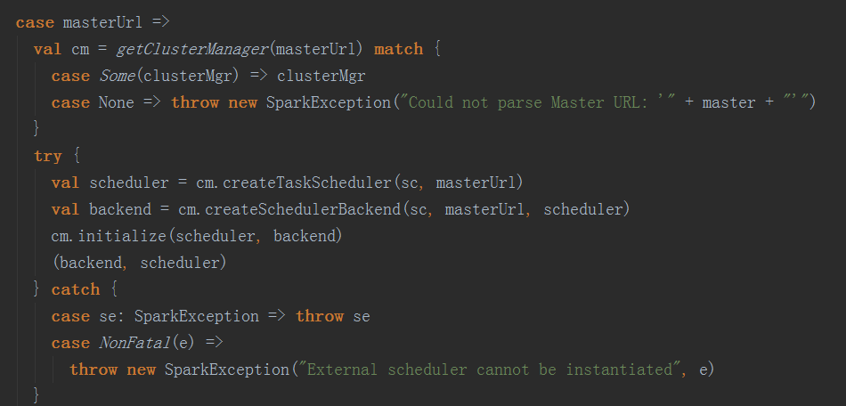
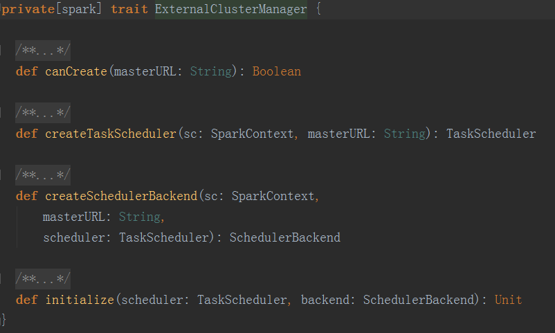
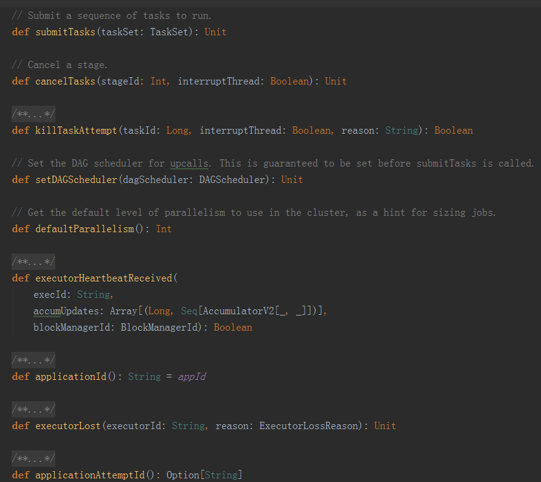
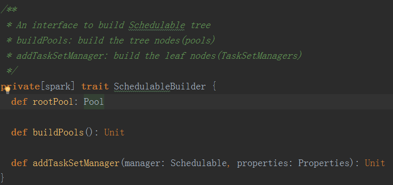

## 存在的问题

* 服务之间存在资源竞争，比如UDE/ES与spark作业的cpu、内存竞争，导致ES请求或者任务阻塞。
* 服务之间资源无法弹性共享，如ES、UDE占用的内存无法在空闲时给批处理作业(长服务占用的资源长期不释放)。
* 服务之间只有资源硬划分隔离方式。
* 服务内部需要自己实现资源管理和调度。
* 服务没有统一调度，有些服务跑在yarn上，有些服务跑在local上。
* 服务资源隔离没有统一，有些服务是jvm隔离，只能隔离内存，有些服务yarn隔离，可以隔离内存和cpu。

## 解决方案

针对现有的问题，我们希望达成以下的目标：

* 透明的系统资源访问： 对应用来说只需看到当前有多少资源可用， 去申请即可。
* 实现多业务之间的数据共享、 资源隔离、 资源弹性共享。
* 真正做到了批处理作业和长服务混合部署动态调度（ 应用管理）。

那么我们就提出了一套解决方案，可以描述为：
* 引入一套资源管理框架，可以承载全部计算类服务。
* 增加统一的应用管理层管理全部的服务。
* 将平台资源管理分为两层结构：第一层服务级别交给应用管理和资源管理框架，第二层app内部资源管理交给app自己。

这里的应用管理框架可以分为三个步骤：

* 预估模型：通过预估模型判断任务需要的资源。
* 资源监视：通过资源监视模块获取组件剩余资源。
* 作业调度：通过上述资源的监视情况，调度作业。

后续会深入spark源码直接调度task(任务)

### 术语约定

这里有一些术语需要约定。

* 作业：job
* 任务：task
* 数据量: Row_Count
* 时间跨度： Rowkey_Range
* 系数：weight，这个系数后续看是否能利用一些机器学习算法自适应学习。
* 迭代数据量：iteration_numnber
* 迭代次数：iteration_count
* 占用内存大小： memory_size
* 检索类型有：排序(sort)、分组(group)、分页(limit)、聚合(join)、过滤(filter)

### 预估模型

预估模型的主要作用就是估计一个任务需要的资源，可以理解为是一个先验模型。建立预估模型，当然，这个预估模型是一个经验模型，所以训练好这个模型后，需要更多的数据对模型进行改进。

在这个模型上，需要预估的资源就包括：

* cpu
* IO
* network
* memory

这里比较难预估的是内存，其实就是对每条数据的每个字段需要占用多大内存作预估，这个可以先粗略估计下每条数据占用多少内存，然后等作业做完后计算真实使用的内存，再调整先前的预估系数，相当于一个先验和后验的步骤。

关于估计模型的建立可以预先统计一些信息，根据不同的框架分别建立不同的模型，这里做了一个简化，假设每种类型的字段占用内存相差不大，那么统计数据大致可以分为三种模型：

#### 模型1

* 表名：时间跨度(rowkey范围)：系数

#### 模型2

* 表名：数据量(Row Count)：系数

#### 模型3

主要存储每个表中的每条数据占用内存大小。

* 表名：所有字段名(\*)：占用内存：系数(weight)
* 表名：字段(字段类型)：占用内存量:系数
* 表名：字段：时间跨度(rowkey范围)：占用内存量:系数
* 表名：字段：时间跨度：检索类型(sort、join、limit、group、filter)：占用内存量：系数

对于上述的检索类型，由于前期可以预先统计的数据比较少，缺乏初始值，所以模型建立之前可能需要临时预查，然后用查询后的结果建立模型，目前我们的系统查询主要有ES和Hbase，所以分两种情况讨论。

1、如果查询走ES，那么有如下几种情况需要临时查询：
* 如果没有sort或者group条件，但是有limit条件，比如查询语句是：**select fieldA, fieldB from tableA limit 10000**，那么fieldA、fieldB字段组合后的每条数据的内存 * 系数 * 10000，也就是说 **memory_size(fiedlA, fieldB) * weight * limit** 。
* 如果没有sort或者group条件，并且没有limit条件，比如查询语句是：**select fieldA, fieldB from tableA**，那么占用内存大小是： **memory_size(fieldA,fieldB) * weight * Row_Count** 。
* 如果有sort或者group条件，并且有limit条件，比如查询语句是：**select fieldA, fieldB from tableA order by fieldA limit 10000**，那么占用内存大小是：**memory_size(fieldA,fieldB) * weight * Row_Count** 。
* 如果有sort或者group条件，但是没有limit条件，比如查询语句是：**select fieldA, fieldB from tableA order by fieldA **，那么占用内存大小是：**memory_size(fieldA,fieldB) * weight * Row_Count** 。

2、如果查询走Hbase，那么有如下几种情况需要临时查询，这里假设迭代数据量(iteration_number)是1000：
* 如果没有sort或者group条件，但是有limit条件，比如查询语句是：**select fieldA, fieldB from tableA limit 10000**，那么占用内存大小是： **memory_size(fieldA ,fieldB) * weight * iteration_number * iteration_count** 。
* 如果没有sort或者group条件，并且没有limit条件，比如查询语句是：**select fieldA, fieldB from tableA**，那么占用内存大小是： **memory_size(fieldA,fieldB) * weight * iteration_number * iteration_count** 。
* 如果有sort或者group条件，并且有limit条件，比如查询语句是：**select fieldA, fieldB from tableA order by fieldA limit 10000**，那么占用内存大小是：**memory_size(fieldA,fieldB) * weight * Row_Count** 。
* 如果有sort或者group条件，但是没有limit条件，比如查询语句是：**select fieldA, fieldB from tableA order by fieldA **，那么占用内存大小是：**memory_size(fieldA,fieldB) * weight * iteration_number * iteration_count** 。

针对预估模型不准确的问题，有很多种解决方案：
* 任务提交上来后，发现资源不够，那么可以先把任务放到等待队列中，然后定时定次数重新去获取spark和es的资源。
* 任务提交上来后，发现资源不够，那么可以检测正在运行的任务，获取消耗的资源量，这样判断是否是因为没有触发内存GC的缘故，导致了资源不够，这样的方案就可以监控下JVM进程的GC。

### 资源监视

通过预估模型就能大致知道用户的应用程序需要的资源，包括cpu，内存，磁盘等。然后通过资源监视模块可以知道每个组件剩余的可用资源和作业运行时的资源使用情况。

关于作业运行时资源使用情况可以分如下两种：spark的资源监视和es的资源监视。

#### spark的资源监视

通过如下方式就可以获取到每个spark应用的所有executor消耗的资源。

* http://localhost:4040/api/v1/applications/[app-id]/executors

具体例子比如这样访问：http://10.65.223.244:4040/api/v1/applications/app-20170525093745-0001/executors

可以获取到的数据有：id: 标识是executor还是driver。hostPort、isActive、rddBlocks、memoryUsed、diskUsed、 totalCores、 maxTasks、 activeTasks、 failedTasks、 completedTasks、 totalTasks、 totalDuration、 totalGCTime、 totalInputBytes、 totalShuffleRead、 totalShuffleWrite、 maxMemory 、executorLogs。

#### es的资源监视

es有自带的api可以查看节点的资源使用情况。
* GET /_nodes：可以获取到服务器可用的内存、cpu、磁盘空间等。关键性的指标有：
  * heap_init_in_bytes
  * heap_max_in_bytes
  * non_heap_init_in_bytes
  * non_heap_max_in_bytes
  * direct_max_in_bytes
* GET /_nodes/stats?all=true：可以获取到存储在节点上的文档数，也提供了JVM、网络和文件系统的相关度量。关键性指标有：
  * docs：文档总数和删除文档数。
  * heap_used_in_bytes
  * heap_used_percent
  * heap_committed_in_bytes
  * heap_max_in_bytes
  * non_heap_used_in_bytes
  * non_heap_committed_in_bytes

es有很多插件也可以看到资源使用情况，比如：Elasticsearch-head、Bigdesk、Marvel、Kopf、Kibana、Nagios等。

通过上述的资源监视，
* 如果作业在运行时发现有OOM的危险，那么就需要杀死任务，目前需要知道es的断路由的方式能否杀死运行中的任务。
* 如果任务成功运行完成，那么需要知道任务在运行时需要的最大资源，那么用这个后验条件去调整先前的资源预估模型参数。

### 作业调度

根据预估模型和资源使用情况，会对任务作调度，可以把任务分为三种状态：运行，拒绝，等待，并且对作业按照一定的规则设置优先级。
* 如果资源够用那么就运行任务。
* 如果任务需要的资源超过了最大资源，那么就拒绝该任务。
* 如果任务需要的资源没有超过最大资源，但是超过了可用资源，那么就把任务放入等待队列，然后当资源够用时按照优先级调度任务。

这里如果任务被提交上去，那么就需要监控作业运行状态

## 具体实现

整个资源调度模块大致分为上述描述的三个模块，具体实现方式在已经有大概的描述，这里稍微补充下，然后对任务调度做详细描述。
资源调度是一个单独的工程，并且整个框架也是可配置可插拔式的，而且应该对于具体的资源监视组件也是可以配置的，也就是说即可以监视spark也可以监视flink，即可以监视es也可以监视solr，即可以监视hbase，也可以监视Cassandra。

可配置的参数包括：
* 需要监视的组件，比如计算框架spark还是flink，检索引擎是es还是solr等。
* 预估任务资源时，每个任务占内存和cpu的系数。
* 预估系统资源时，系统资源的安全系数。
* 预估内存资源时，每条数据占用的内存比例。

### 任务调度

这里主要描述下任务调度的实现，这个应该是第二个阶段需要做的事。

当spark任务提交后，会创建SparkContext，在SparkContext中会创建任务调度模块，如下图所示：

这里masterUrl就是用户通过spark-submit中的--master参数传进来的。然后通过getClusterManager判断masterUrl是否有效，如果有效那么就通过ServiceLoader加载ExternalClusterManager的子类。这里ExternalClusterManager类有一个方法createTaskScheduler,主要实现的是一个外部的可插拔的Scheduler。这个ExternalClusterManager类的所有方法都是我们需要实现的，如下所示：

* canCreate方法根据输入的master url验证是否可以创建新的scheduler。
* createTaskScheduler就是根据给定的SparkContext创建task Scheduler。
* createSchedulerBackend根据给定的SparkContext和Scheduler创建Scheduler backend。
* initialize就是初始化task Scheduler和backend Scheduler。

上图中的createTaskScheduler方法主要是实现TaskScheduler特质。最后任务调度会交给SchedulerBackend，主要有local、standalone、yarn、mesos。TaskScheduler需要实现的方法如下图所示：

* submitTasks方法是提交一系列的tasks。
* cancelTasks方法是删除一个stage。
* killTaskAttemt方法是杀死一个尝试中的task，返回结果是task是否成功杀死。
* setDAGScheduler方法是配置DAG调度。
* executorLost方法是处理一个丢失了的executor。

任务调度交给具体的backend后，比如standalone，那么调度算法有：

* FIFO
* fairscheduler

如果这两个算法不能满足我们的需求，那么我们需要实现一种新的任务调度模块称之为：HIKScheduler。并且需要继承SchedulableBuilder，主要实现的方法有：

这样就整体实现了一个我们自己的可插拔的spark任务调度方式。
